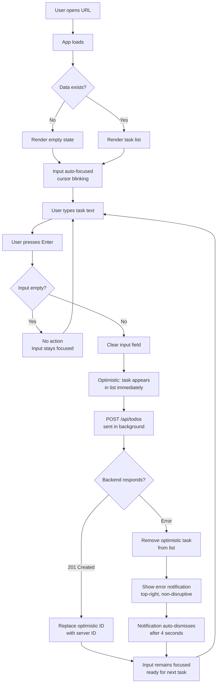
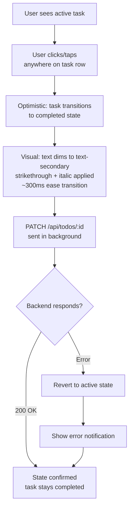
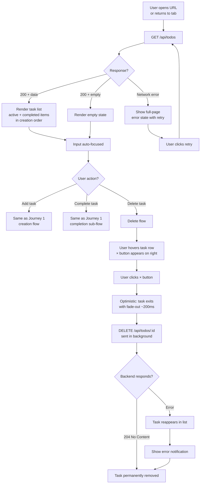
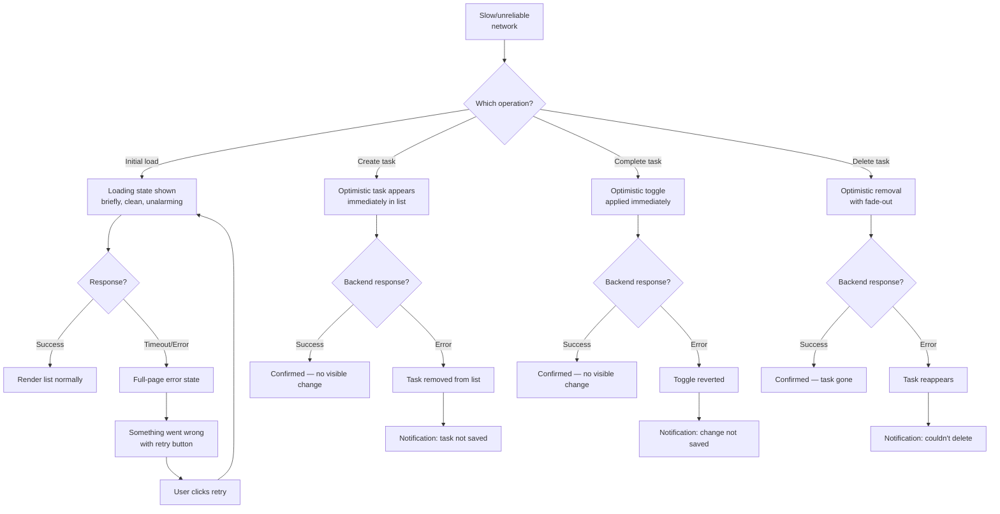

---
stepsCompleted:
  - step-01-init
  - step-02-discovery
  - step-03-core-experience
  - step-04-emotional-response
  - step-05-inspiration
  - step-06-design-system
  - step-07-defining-experience
  - step-08-visual-foundation
  - step-09-design-directions
  - step-10-user-journeys
  - step-11-component-strategy
  - step-12-ux-patterns
  - step-13-responsive-accessibility
  - step-14-complete
lastStep: 14
inputDocuments:
  - planning-artifacts/prd.md
  - planning-artifacts/architecture.md
---

# UX Design Specification bmad

**Author:** Brainrepo
**Date:** 2026-03-06

---

## Executive Summary

### Project Vision

A deliberately minimal Todo application that treats restraint as its defining feature. Where competitors accumulate functionality, this product invests in craft — every interaction communicates intentionality. The UX north star is not speed or feature count, but the feeling that someone cared about every detail. Inspired by the Moleskine iOS aesthetic: understated, elegant, premium through simplicity.

### Target Users

Sam — a freelance designer frustrated by feature-bloated productivity tools. General audience, no technical assumptions. Uses desktop and mobile equally for quick task capture throughout the day. Returns across sessions expecting reliability. Values the feeling of a well-made tool over a powerful one.

### Key Design Challenges

- Communicating craftsmanship through an extremely minimal surface area — 6 interactive elements must each feel intentional
- Dark interface with clear active/completed visual hierarchy under WCAG 2.1 AA contrast requirements
- Edge states (empty, loading, error) that feel as designed as the core experience
- Touch-friendly interactions (44x44px targets) that feel native across desktop and mobile

### Design Opportunities

- Micro-interactions as signature moments — add, complete, delete transitions that communicate care
- Typography-driven design — beautiful type hierarchy replacing heavy UI chrome (Moleskine-inspired)
- Empty state as brand moment — the first impression sets the entire tone
- Dark palette creating a focused, premium feel that reduces eye strain and elevates task content

## Core User Experience

### Defining Experience

The core loop is **add → scan → complete**. Adding a task is the heartbeat: type text, hit Enter, see it appear instantly via optimistic update. The secondary loop is scanning the list and tapping to mark done. Every other interaction (delete, error recovery) is peripheral to this core.

The ONE interaction to get right: **typing a task and pressing Enter**. If this feels instant, fluid, and satisfying, the product succeeds.

### Platform Strategy

- Web application, responsive 320px–1920px
- Touch (mobile) and mouse/keyboard (desktop) equally supported
- No offline capability in MVP
- No native app features — pure browser experience
- Input auto-focuses on page load for immediate task capture

### Effortless Interactions

- **Adding a task:** Type → Enter → task appears instantly. No "add" button click required (button exists for discoverability/accessibility). Input clears and retains focus for rapid sequential entry.
- **Completing a task:** Single tap/click — no confirmation, instant visual shift (smooth strikethrough + dim).
- **Deleting a task:** Single action — no confirmation modal, task disappears cleanly.
- **Returning after days:** Open URL → everything exactly as left. Zero re-engagement friction. No "welcome back" dialogs.

### Critical Success Moments

1. **First task added** — Sam types, hits Enter, sees the task appear instantly. "This just works."
2. **First task completed** — Sam taps, sees the satisfying visual transition. "That felt good."
3. **Returning the next day** — Everything is there. Trust established.
4. **Empty state** — Before the first task, Sam sees something that says "I was designed with care" — not a blank void.

### Experience Principles

1. **Every pixel earns its place** — Nothing decorative, nothing unused. If it's visible, it has a purpose.
2. **Actions feel immediate** — Optimistic updates mean the UI never waits for the server. The app feels local.
3. **States are designed, not handled** — Empty, loading, and error are first-class design moments, not afterthoughts.
4. **Restraint is the feature** — The absence of features IS the value proposition. Resist adding.

## Desired Emotional Response

### Primary Emotional Goals

**Calm confidence** — the feeling of a tool that just works, that doesn't demand attention, that respects your time. Not excitement, not "delight" in the confetti sense. A quieter satisfaction — like using a well-made pen.

### Emotional Journey Mapping

| Moment | Desired Feeling |
|---|---|
| First opening the app | Intrigue — "This feels different. Clean." |
| Adding first task | Satisfaction — "That was instant. Effortless." |
| Scanning the list | Clarity — "I know exactly what's active and what's done." |
| Completing a task | Quiet accomplishment — the visual transition feels earned |
| Deleting a task | Decisiveness — clean, no guilt, no "are you sure?" |
| Something goes wrong | Trust — "It told me calmly, nothing was lost." |
| Returning days later | Reliability — "Everything's here. I trust this." |

### Micro-Emotions

**Prioritized:**
- Confidence over confusion — every state is obvious, nothing ambiguous
- Trust over skepticism — data persists, errors are handled, the app feels stable
- Accomplishment over frustration — completing tasks feels satisfying, never tedious

**Emotions to Avoid:**
- Anxiety (will my data be there?)
- Overwhelm (too many options)
- Distrust (did that save?)
- Annoyance (unnecessary confirmations, modals, friction)

### Design Implications

- **Calm confidence** → Dark, muted palette. No bright CTAs screaming for attention. Smooth, unhurried transitions.
- **Quiet accomplishment** → Completion animation: subtle, satisfying, not celebratory. Gentle opacity shift + smooth strikethrough, not confetti.
- **Trust** → Optimistic updates make the app feel instant. Error recovery is graceful and honest.
- **Decisiveness** → Delete is immediate, no confirmation dialog. The UI says "you're in control."

### Emotional Design Principles

1. **Quiet over loud** — Communicate through subtlety (opacity, weight, spacing) not through bold color, icons, or animations
2. **Honest over reassuring** — When something fails, say so clearly and calmly. No fake optimism, no excessive "everything's fine" messaging.
3. **Confident over cautious** — No "are you sure?" dialogs. Trust the user. They meant to do that.
4. **Present over persistent** — Errors appear, inform, and fade. Nothing lingers demanding attention.

## UX Pattern Analysis & Inspiration

### Inspiring Products Analysis

**Actions by Bonobo Labs** ([bonobolabs.com/actions](https://bonobolabs.com/actions/))

The studio behind the Moleskine digital apps. Their design DNA defines the quality bar for bmad:

- **Emotion over features** — Value proposition is *how it feels*, not what it does. "The first todo app you'll actually love using."
- **Animation as differentiator** — Micro-interactions are "always surprising." Gestures and transitions are deliberate brand signatures, not decoration.
- **Simplicity as speed** — "Lightning fast to use and easy to understand." Simplicity is framed as an advantage, not a limitation.
- **Tasks as visual objects** — Action Cards give each task tangible presence and visual weight.
- **Beautiful color work** — "Vivid to pastel" range. Color is treated as a design material even in utility apps.
- **Polished voice** — "LifeSorted." — confident, concise. Every piece of copy feels considered.
- **Craft across the ecosystem** — Actions, Timepage, Flow all share the same design DNA: premium feel through animation and typography, not UI chrome.

### Transferable UX Patterns

**Adopt:**
- Task as visual object — each todo should feel tangible, not like a database row. Generous padding, typographic weight, spatial presence.
- Animation as brand signature — completion, add, and delete transitions are the moments that make people say "this feels good." Subtle but intentional.
- Simplicity as speed — input-to-task flow faster than any competitor. Zero intermediary steps.
- Color with restraint — single accent color in dark theme, used sparingly. Task text is the visual focus.

**Adapt:**
- Actions uses cards, categories, scheduling — more surface area. bmad adopts the *craft quality*, not the feature set.
- Actions offers vivid customization. bmad has ONE beautiful default — the constraint is the aesthetic.

**Reject:**
- Feature density — "sophisticated tools under the hood" is Actions' philosophy, not bmad's.
- Configuration options — no color pickers, layout choices, or list categories.
- Onboarding flows — Actions needs them for its features. bmad needs none.

### Anti-Patterns to Avoid

- Feature-creep disguised as polish — "just one more option" breaks the restraint philosophy
- Generic list styling — plain text rows with checkboxes feel like a template, not a product
- Celebration overload — confetti, badges, streaks communicate gamification, not craftsmanship
- Confirmation dialogs — "Are you sure?" breaks the feeling of confidence and control
- Loading skeletons that don't match actual layout — feels worse than a simple spinner

### Design Inspiration Strategy

**Adopt:** Bonobo's craft quality — animation as signature, typography as hierarchy, spatial generosity, premium feel through restraint
**Adapt:** Card-like presence for tasks without literal cards — achieve visual weight through spacing, type, and subtle dividers in the dark theme
**Reject:** Feature sophistication, customization, and onboarding — bmad's identity is radical simplicity

## Design System Foundation

### Design System Choice

Custom micro-design system built on Tailwind CSS v4.2. No external component library. The UI surface (7 components) is small enough that a focused set of design tokens and consistent Tailwind patterns provide all the consistency needed.

### Rationale for Selection

- 7 total components — a full design system adds overhead without proportional value
- Bonobo-inspired craft quality requires pixel-level control that component libraries constrain
- Tailwind's utility classes provide built-in consistency for spacing, sizing, and responsive behavior
- Dark theme with a single accent color is simpler to implement as custom tokens than to override in a component library
- Architecture already committed to Tailwind — no additional dependency needed

### Implementation Approach

**Design Tokens (Tailwind custom theme):**
- `--color-bg`: dark background (deep navy-dark)
- `--color-surface`: slightly elevated surface for todo items
- `--color-text-primary`: high-contrast text for active todos
- `--color-text-secondary`: dimmed text for completed todos and metadata
- `--color-accent`: single accent for interactive elements
- `--color-error`: non-alarming error color (warm, not aggressive red)
- `--font-family`: clean modern sans-serif (Inter or system font stack for zero load time)
- `--spacing-unit`: consistent spacing scale via Tailwind defaults
- `--radius`: subtle border radius for interactive elements
- `--transition`: consistent transition duration and easing for all animations

**Component Patterns:**
- Each component follows the same structural pattern: semantic HTML, ARIA attributes, Tailwind classes, consistent spacing
- No wrapper div soup — lean, accessible markup
- Animations via Tailwind `transition` + `animate` utilities or CSS `@keyframes` for signature moments

### Customization Strategy

- No user-facing customization in MVP — ONE beautiful default
- Design tokens centralized in Tailwind config for developer-side consistency
- Future phases could introduce light theme via token swap

## Defining Core Experience

### The Defining Experience

**"Capture a thought before it escapes."** — Type → Enter → it exists. The interaction is so fast and frictionless that the app disappears. Sam thinks about the task, not the tool. Like writing in a Moleskine — pen touches paper, thought is captured. No menus, no categories, no friction between intention and action.

### User Mental Model

Users bring the mental model of a **physical notepad**: write it down, cross it off, tear it out. No learning curve because the metaphor is universal.

- **Add = write it down** — single input, no fields to fill
- **Complete = cross it off** — visual line-through, task dims but remains visible
- **Delete = tear it out** — gone, no trace, no undo

Users expect immediacy because physical notepads are immediate. The optimistic update pattern ensures the digital version matches this expectation.

### Success Criteria

- User adds first task within 3 seconds of opening the app — no orientation needed
- Input field is visually obvious and auto-focused — the cursor blinks, inviting action
- Enter key submits, input clears and retains focus — enables rapid sequential entry ("brain dump" mode)
- Task appears in the list within 100ms (optimistic update) — feels instant
- No visual noise competes with the input field or the task list

### Novel UX Patterns

Established patterns used — no novel patterns needed. The interaction is universally understood: text input + list. The innovation is not in the pattern but in the *execution quality* — how the task appears (animation), how completion feels (transition), how the empty state invites (typography).

**Unique twist on established patterns:**
- No visible "add" button prominence — Enter key is the primary action, keeping the interface clean. A subtle submit affordance exists for discoverability and accessibility.
- Completion is a toggle, not a checkbox — the entire todo item is the tap target, making completion feel spatial and physical rather than mechanical.
- No "completed" section — completed tasks remain in-line, dimmed and struck through, maintaining context and order.

### Experience Mechanics

**1. Initiation:**
- App loads → input field is auto-focused with blinking cursor
- Placeholder text: subtle, warm, inviting (e.g., "What needs doing?")
- On mobile: keyboard may not auto-open (platform constraint), but input field is visually prominent and tappable

**2. Interaction:**
- User types task description
- Enter key (desktop) or submit button (mobile) creates the task
- Input clears instantly, retains focus for next task
- New task appears at the top/bottom of the list with a subtle entrance animation (fade-in + slight slide)

**3. Feedback:**
- Task appears immediately (optimistic update) — no loading indicator for the add action
- If backend fails: task rolls back, error notification appears top-right, non-disruptive
- Completion toggle: tap/click anywhere on the task → smooth transition (opacity reduces, text gets strikethrough, ~300ms ease)
- Delete: tap delete control → task exits with subtle fade-out (~200ms)

**4. Completion:**
- The "done" state is visual, not navigational — no separate view, no archive
- The list IS the product — when empty, the empty state welcomes the next task
- Session ends by closing the tab — no save button, no logout, no "see you later"

## Visual Design Foundation

### Color System

**Dark palette — deep, warm, not cold:**

| Token | Role | Value | Notes |
|---|---|---|---|
| `bg` | Page background | `#141419` | Near-black with subtle warmth — not pure `#000` |
| `surface` | Todo item surface | `#1c1c24` | Slightly elevated, distinguishable from bg |
| `surface-hover` | Item hover/focus | `#24242e` | Subtle lift on interaction |
| `text-primary` | Active todo text | `#e8e8ed` | High contrast against dark bg (~15:1 ratio) |
| `text-secondary` | Completed text, metadata | `#6b6b7b` | Dimmed but legible (~4.5:1 minimum for WCAG AA) |
| `text-placeholder` | Input placeholder | `#4a4a58` | Visible but unobtrusive |
| `accent` | Interactive elements, focus rings | `#7c9cb5` | Muted steel blue — calm, not aggressive |
| `error` | Error notification | `#c4756e` | Warm terracotta — noticeable but not alarming |
| `border` | Subtle dividers | `#2a2a35` | Barely visible separation between items |

**Rationale:** Warm darks (slight blue-purple undertone) feel Moleskine-premium, not sterile. Single accent (steel blue) used only for interactive affordances and focus states. Error color is warm, not alarming — matches "honest over reassuring" principle.

### Typography System

**Font:** System font stack (`-apple-system, BlinkMacSystemFont, 'Segoe UI', sans-serif`) — zero load time, native feel on every platform. If a branded feel is desired later, Inter can be swapped in via a single token change.

**Type Scale:**

| Element | Size | Weight | Usage |
|---|---|---|---|
| App title | 1.5rem (24px) | 300 (light) | Top of page, subtle presence |
| Todo text (active) | 1rem (16px) | 400 (regular) | Primary content |
| Todo text (completed) | 1rem (16px) | 400 + strikethrough | Dimmed via `text-secondary` color |
| Timestamp / metadata | 0.75rem (12px) | 400 | Creation date, subtle |
| Input placeholder | 1rem (16px) | 400 | "What needs doing?" |
| Error message | 0.875rem (14px) | 400 | Non-disruptive notification |
| Empty state heading | 1.25rem (20px) | 300 (light) | Welcoming, not commanding |
| Empty state subtext | 0.875rem (14px) | 400 | Brief guidance |

**Line height:** 1.5 for body text, 1.2 for headings — generous for readability.

**Rationale:** Light weight for headings communicates elegance (Moleskine DNA). Regular weight for task text prioritizes readability. No bold anywhere — hierarchy achieved through size, color, and opacity, not weight.

### Spacing & Layout Foundation

**Base unit:** 4px — all spacing is multiples of 4.

**Key spacing values:**

| Context | Value | Usage |
|---|---|---|
| Component internal padding | 16px (4×4) | Inside todo items, input field |
| Between todo items | 2px | Tight list with subtle `border` divider |
| Section spacing | 24px (6×4) | Between input and list |
| Page margins (desktop) | 48px (12×4) | Generous side margins |
| Page margins (mobile) | 16px (4×4) | Full-width on small screens |
| Max content width | 640px | Centered, readable line length |

**Layout approach:**
- Single-column, centered layout — max-width 640px
- No grid system needed — content is linear
- Generous vertical rhythm — the app should feel spacious, not dense
- Mobile-first: full-width on small screens, centered with breathing room on desktop

**Rationale:** 640px max-width matches optimal reading line length. Tight inter-item spacing (2px divider) keeps the list scannable while generous page margins create the "premium, spacious" feel. The app should feel like a page in a notebook, not a spreadsheet.

### Accessibility Considerations

- All text-on-background combinations meet WCAG 2.1 AA minimum (4.5:1 for normal text, 3:1 for large text)
- `text-secondary` on `bg` verified at ~4.5:1 — the floor for completed task text
- Focus ring: 2px solid `accent` with 2px offset — visible on all interactive elements
- Touch targets: minimum 44x44px on all interactive elements (todo items, delete button, input)
- No color-only state communication — completed tasks use both color change AND strikethrough
- Reduced motion: respect `prefers-reduced-motion` media query — disable entrance/exit animations

## Design Direction Decision

### Design Directions Explored

Six visual directions were generated from the established color, typography, and spacing foundation:

1. **Stark Minimal** — Underline input, no surfaces, maximum negative space. Pure reduction.
2. **Notebook Lines** — Ruled-line background, dot indicators. Literal Moleskine metaphor.
3. **Elevated Cards** — Bordered cards with hover lift and shadow. Tactile, structured.
4. **Dense & Functional** — Compact layout, checkboxes, task count. Tool-like efficiency.
5. **Bottom Input** — Input anchored at bottom. List-first spatial hierarchy.
6. **Typographic** — Left accent bar, larger text, italic completions, editorial subtitle. Type as art.

### Chosen Direction

**Direction 6 — Typographic**

Key elements:
- Left accent bar (`2px solid accent`) on the input field — editorial marker that draws the eye to the capture point
- Larger task text (`1.125rem`, weight `300`) — elegant, readable, generous
- Completed tasks use both italic + strikethrough + dimmed color — triple signal, never ambiguous
- Hover reveals a left border on each item — subtle interactive cue without changing text color
- Subtitle ("a simple list") — quiet personality, not functional but atmospheric
- Uppercase metadata with letter-spacing — magazine typography for timestamps
- Generous vertical padding per item (`16px`) with left indentation from the accent bar

### Design Rationale

The Typographic direction is the most editorial and least tool-like of the six — which is exactly what "deliberate restraint" and "calm confidence" demand. It treats the task list as a typographic composition rather than a data table.

- **Left accent bar** creates a vertical rhythm that echoes the spine of a Moleskine notebook
- **Light weight (300)** for task text communicates elegance over utility
- **Italic completions** add a handwritten, crossed-out feel — more human than a simple dimming
- **Uppercase metadata** provides temporal context without competing with task text
- **No checkboxes, no icons** — the text itself is the interface, consistent with "type as the primary design element"

### Implementation Approach

- Input component: transparent background, `border-left: 2px solid var(--accent)`, `padding-left: 20px`, font-weight 300, font-size 1.125rem
- Todo item: `border-left: 2px solid transparent`, transitions to `var(--border)` on hover. Padding `16px 0 16px 20px`
- Completed state: `color: var(--text-secondary)`, `text-decoration: line-through`, `font-style: italic`
- Metadata: `font-size: 0.6875rem`, `text-transform: uppercase`, `letter-spacing: 0.05em`, `color: var(--text-placeholder)`
- Delete button: absolute-positioned right, opacity 0 → 1 on item hover, `×` character
- App title: `2rem`, weight `200`, letter-spacing `0.04em`
- Subtitle: `0.8125rem`, uppercase, letter-spacing `0.1em`, `color: var(--text-placeholder)`
- All Tailwind utility classes; no custom CSS files needed

## User Journey Flows

### Journey 1: First-Time Task Creation

The defining interaction — a user opens the app and captures their first thought.



**Key design decisions:**
- Auto-focus on load — no click required to start typing
- Enter submits + clears + retains focus — supports rapid sequential entry
- Empty input is silently ignored — no error, no shake, no red border
- Optimistic task uses a temporary client ID, swapped on server response
- Error removes the optimistic entry (honest feedback) and shows notification

**Completion sub-flow (within same journey):**



### Journey 2: Returning User Session

The trust-building interaction — everything is exactly where they left it.



**Key design decisions:**
- No confirmation dialog on delete — deliberate restraint, respects the user's intent
- Delete affordance (×) only visible on hover — clean list, discoverable on interaction
- On delete error, the task reappears — honest recovery, no silent data loss
- Initial load error gets a full-page treatment (not a notification) because there's no content to show
- Tasks rendered in creation order — stable, predictable positioning

### Journey 3: Error & Edge Case Handling

The resilience interaction — things go wrong, but the experience holds.



**Error notification pattern:**
- Position: top-right corner, outside the content column
- Style: `bg: surface`, `border-left: 2px solid error`, text in `text-primary`
- Content: brief, specific ("Task not saved — try again")
- Behavior: auto-dismiss after 4 seconds, no manual dismiss needed
- No stacking — latest notification replaces previous

**Input validation (silent):**
- Empty input + Enter → no action, no error, no visual feedback
- Whitespace-only input → treated as empty
- Leading/trailing whitespace → trimmed before submission
- Maximum length (if enforced by backend schema) → input stops accepting characters

### Journey Patterns

**Pattern: Optimistic-First**
All mutations (create, complete, delete) apply UI changes immediately. The backend is an async confirmation, not a gate. On failure, the UI honestly reverts and notifies.

**Pattern: Focus Persistence**
The input field retains focus across all operations — after adding a task, after an error, after page load. The user is always one keystroke away from capturing a thought.

**Pattern: Progressive Affordance**
Interactive controls (delete ×) are hidden until hover. The resting state is clean and typographic. Interactivity reveals itself on engagement.

**Pattern: Honest Recovery**
Errors never leave the UI in an inconsistent state. If something fails, the optimistic change is reverted — not hidden, not ignored. The notification is calm but clear.

### Flow Optimization Principles

1. **Zero steps to value** — Auto-focused input on load means the user types immediately. No click, no scroll, no selection.
2. **Single-action completion** — Click anywhere on the task row to toggle. No checkbox to find, no menu to open.
3. **Silent validation** — Invalid inputs (empty, whitespace) are silently ignored. The app doesn't scold.
4. **Invisible persistence** — Data saves automatically. No save button. No "changes saved" toast. It just works.
5. **Calm failure** — Errors are a brief, peripheral notification. They inform without interrupting the flow.

## Component Strategy

### Design System Components

**Foundation:** Tailwind CSS utility classes + custom design tokens (CSS custom properties). No pre-built component library — every component is purpose-built for this application's typographic design direction.

**Design tokens provided by the foundation:**

| Category | Tokens | Source |
|---|---|---|
| Colors | `bg`, `surface`, `surface-hover`, `text-primary`, `text-secondary`, `text-placeholder`, `accent`, `error`, `border` | Visual Foundation |
| Typography | System font stack, weight 200/300/400, sizes 0.6875–2rem | Visual Foundation |
| Spacing | 4px base unit, key values 2px–48px | Visual Foundation |
| Layout | Max-width 640px, single-column centered | Visual Foundation |

**What Tailwind provides directly:**
- Flexbox/grid layout utilities
- Spacing, sizing, and positioning
- Transition and animation utilities
- Responsive breakpoints
- Focus ring utilities (`ring-*`)
- `prefers-reduced-motion` media query variant

**What we build custom:** Everything below.

### Custom Components

#### TodoInput

**Purpose:** The capture point — where thoughts become tasks.
**Anatomy:** Single `<input>` element with left accent bar, no surrounding container or button.
**States:**

| State | Visual Treatment |
|---|---|
| Default (empty, focused) | Left border `accent`, placeholder "What needs doing?" in `text-placeholder` |
| Typing | Text in `text-primary`, weight 300, size 1.125rem |
| Submitting | Input clears instantly, focus retained — no visual change during submission |

**Interaction:** Enter submits, clears, retains focus. Empty/whitespace input silently ignored.
**Accessibility:** `aria-label="Add a new task"`, auto-focused on mount, visible focus ring (accent).

#### TodoItem

**Purpose:** A single task in the list — the core content unit.
**Anatomy:** Task text (left), delete button (right, hover-only). Left border for hover state. Timestamp metadata below text.
**States:**

| State | Visual Treatment |
|---|---|
| Active | Text `text-primary`, weight 300, size 1.125rem. Left border transparent. |
| Active + hover | Left border `border` color. Delete `×` appears (position absolute, right). |
| Completed | Text `text-secondary`, strikethrough, italic. Left border transparent. |
| Completed + hover | Left border `border` color. Delete `×` appears. |
| Deleting (exit) | Fade-out ~200ms, then removed from DOM. |
| Error recovery | Task reappears with no animation (instant). |

**Interaction:** Click/tap anywhere on row toggles completion. Click `×` deletes.
**Accessibility:** `role="button"` for toggle, `aria-label` for delete ("Delete task: [text]"), minimum 44px touch height. `aria-checked` state for completion.

#### TodoList

**Purpose:** Container for all TodoItem components.
**Anatomy:** Ordered `<ul>` of TodoItem elements. No additional visual treatment — the items define the visual.
**States:**

| State | Visual Treatment |
|---|---|
| Populated | Vertical stack of TodoItems, no gap (items define their own padding). |
| Empty | Replaced by EmptyState component. |
| Loading | Replaced by LoadingState component. |

**Interaction:** None directly — delegates to child TodoItem components.

#### EmptyState

**Purpose:** Welcome message when no tasks exist — the first thing a new user sees.
**Anatomy:** Centered heading + subtext, vertically positioned in the list area.
**Content:**
- Heading: "Nothing here yet" — weight 300, size 1.25rem, color `text-secondary`
- Subtext: "Type above and press Enter" — size 0.875rem, color `text-placeholder`

**States:** Single state only. Appears when todo list is empty, disappears when first task is added.

#### LoadingState

**Purpose:** Brief, calm indicator during initial data fetch.
**Anatomy:** Minimal text indicator centered in the list area.
**Content:** "Loading..." — size 0.875rem, color `text-placeholder`, weight 400.
**States:** Single state. Visible only during initial GET request, not during mutations.

#### ErrorState (Full-page)

**Purpose:** Shown when initial data fetch fails — no content available to display.
**Anatomy:** Centered message + retry button.
**Content:**
- Message: "Something's not right" — weight 300, size 1.25rem, color `text-secondary`
- Retry button: text-style button, `accent` color, "Try again" — no filled/outlined button style

**States:** Single state. Only used for initial load failure.

#### ErrorNotification

**Purpose:** Non-disruptive feedback when a mutation fails.
**Anatomy:** Fixed-position element, top-right corner. Left accent bar in `error` color, text on `surface` background.
**Content:** Brief message ("Task not saved — try again"), size 0.875rem.
**States:**

| State | Visual Treatment |
|---|---|
| Entering | Fade-in from right ~200ms |
| Visible | `surface` background, `border-left: 2px solid error`, shadow |
| Exiting | Fade-out ~200ms, auto-dismisses after 4 seconds |

**Behavior:** Latest notification replaces previous — no stacking. No manual dismiss.
**Accessibility:** `role="alert"`, `aria-live="polite"`.

#### AppHeader

**Purpose:** Application identity — title and subtitle.
**Anatomy:** Title ("things to do") + subtitle ("a simple list"), no navigation, no actions.
**Content:**
- Title: weight 200, size 2rem, letter-spacing 0.04em, `text-primary`
- Subtitle: weight 400, size 0.8125rem, uppercase, letter-spacing 0.1em, `text-placeholder`

**States:** Single state. Static, never changes.

### Component Implementation Strategy

**Approach:** All components built as React functional components using Tailwind utility classes. Design tokens defined as CSS custom properties in `:root` and consumed via Tailwind's `theme.extend` configuration.

**Token integration with Tailwind:**
- Extend `tailwind.config.ts` with custom colors (`bg`, `surface`, `accent`, etc.)
- Extend font sizes with the type scale values
- Use `@apply` sparingly — prefer inline utility classes for transparency

**Component file structure:**
```
frontend/src/components/
├── todo-input.tsx
├── todo-item.tsx
├── todo-list.tsx
├── empty-state.tsx
├── loading-state.tsx
├── error-state.tsx
├── error-notification.tsx
└── app-header.tsx
```

**Conventions:**
- One component per file, named export
- Props defined with TypeScript interfaces
- No `forwardRef` unless needed for focus management (TodoInput may need it)
- Transitions via Tailwind `transition-*` utilities
- Responsive: full-width on mobile (`px-4`), centered with max-w on desktop

### Implementation Roadmap

**Phase 1 — Core (MVP critical path):**
1. `TodoInput` — needed for task creation (Journey 1 entry point)
2. `TodoItem` — needed for task display, completion, deletion
3. `TodoList` — container for items
4. `EmptyState` — first thing a new user sees

**Phase 2 — Resilience:**
5. `ErrorNotification` — needed for mutation error feedback (Journey 3)
6. `LoadingState` — needed for initial data fetch
7. `ErrorState` — needed for load failure recovery

**Phase 3 — Polish:**
8. `AppHeader` — title and subtitle (can be hardcoded initially, extracted later)

All phases are part of MVP — the roadmap defines build order, not scope cuts.

## UX Consistency Patterns

### Action Patterns

This app has no traditional button hierarchy. Actions are embedded directly into content:

| Action | Trigger | Visual Affordance |
|---|---|---|
| Create task | Enter key in input | No button — keyboard-only submission |
| Complete/uncomplete task | Click/tap on task row | Entire row is the affordance — cursor: pointer |
| Delete task | Click × button | Appears on hover only, positioned right |
| Retry (error state) | Click "Try again" text | Text-style link in `accent` color, no button chrome |

**Design rule:** No filled buttons, no outlined buttons, no button chrome anywhere in the app. Actions are either keyboard-driven (Enter), embedded in content (click row), or text-styled (retry). This is consistent with the typographic design direction.

**Mobile adaptation:** On touch devices, the delete `×` is always visible (no hover state), sized at minimum 44x44px tap target. Task row minimum height is 44px.

### Feedback Patterns

All feedback follows a single principle: **inform without interrupting.**

#### Success Feedback
- **Pattern:** No success feedback. Ever.
- **Rationale:** Optimistic updates make the success visible through the UI change itself. Task appears → that's the success. Task dims with strikethrough → that's the success. Task disappears → that's the success. No toast, no checkmark animation, no "saved!" message.

#### Error Feedback (Mutation)
- **Pattern:** ErrorNotification component (top-right, auto-dismiss)
- **Visual:** `surface` background, `border-left: 2px solid error`, `text-primary` text
- **Content:** Brief, specific, actionable ("Task not saved — try again")
- **Timing:** Auto-dismiss after 4 seconds. No manual dismiss.
- **Stacking:** None. Latest replaces previous.
- **Position:** Fixed top-right, outside the content column — peripheral, not blocking

#### Error Feedback (Initial Load)
- **Pattern:** Full-page ErrorState component (centered in content area)
- **Visual:** Centered text message + "Try again" text link
- **Rationale:** On initial load failure, there's no content to show, so the error IS the content

#### Loading Feedback
- **Pattern:** Text-only LoadingState component
- **Visual:** "Loading..." in `text-placeholder` color, centered
- **Rationale:** Brief and calm. No spinner, no progress bar, no skeleton screen. The load is fast enough that an elaborate loading state would flash distractingly.

### Form Patterns

The app has exactly one form input — TodoInput. These patterns apply to it:

#### Input Behavior
- **Auto-focus:** Input receives focus on page load and retains it across operations
- **Submission:** Enter key only — no submit button
- **Validation:** Silent. Empty/whitespace input → no action, no error, no red border
- **Clearing:** Input clears immediately on successful submission
- **Placeholder:** "What needs doing?" — instructive but not commanding
- **Focus ring:** 2px solid `accent` with 2px offset (via Tailwind `ring-2 ring-accent ring-offset-2`)

#### Input States
| State | Visual |
|---|---|
| Empty + focused | Left accent bar, placeholder visible, cursor blinking |
| Filled + focused | Left accent bar, text in `text-primary` weight 300 |
| Empty + unfocused | Should not occur (auto-focus is persistent) |

### Navigation Patterns

**Pattern:** No navigation. The app is a single view.

- No routes, no tabs, no sidebar, no hamburger menu
- No back button, no breadcrumbs, no page transitions
- The URL is the app — one URL, one view, one purpose
- TanStack Router is used for type-safe routing infrastructure, but the app has a single route (`/`)

### Transition & Animation Patterns

All animations serve function, not decoration:

| Interaction | Animation | Duration | Easing |
|---|---|---|---|
| Task completion toggle | Opacity + color + strikethrough | 300ms | ease |
| Task deletion | Fade-out | 200ms | ease |
| Error notification enter | Fade-in from right | 200ms | ease-out |
| Error notification exit | Fade-out | 200ms | ease-in |
| Task creation (optimistic) | None — appears instantly | 0ms | — |

**Reduced motion:** When `prefers-reduced-motion: reduce` is active, all animations are disabled. State changes are instant. This is implemented via Tailwind's `motion-reduce:` variant.

**Design rule:** No animation exceeds 300ms. No bounce, no spring, no overshoot. Transitions are quick, direct, and purposeful.

### Empty State Pattern

When the task list has zero items:

- **Heading:** "Nothing here yet" — inviting, not empty
- **Subtext:** "Type above and press Enter" — instructional, fades into the background
- **Tone:** Welcoming the next task, not mourning the lack of tasks
- **Transition:** Disappears instantly when first task is added (no exit animation on the empty state itself)

### Interaction Density Pattern

**Resting state (no hover):** The list is purely typographic — text, left accent bar on input, nothing else. No buttons, no icons, no interactive affordances visible.

**Engaged state (hover):** Interactive elements reveal themselves — delete `×` appears, left border appears on hovered item. The interface responds to attention.

**This progressive disclosure keeps the resting UI clean while maintaining discoverability on engagement.**

## Responsive Design & Accessibility

### Responsive Strategy

**The simplicity advantage:** A single-column layout at max-width 640px is inherently responsive. The app doesn't need to transform between device sizes — it needs to *breathe differently*.

**Mobile (< 640px):**
- Content fills available width with 16px side padding
- Input and task items stretch full-width
- Delete `×` always visible (no hover on touch devices)
- All touch targets minimum 44x44px
- App title and subtitle maintain same hierarchy, no size reduction

**Tablet (640px–1024px):**
- Content centered at 640px max-width
- Side margins expand naturally
- Same interaction model as desktop (hover states available)
- No layout changes — the app is already at its ideal width

**Desktop (> 1024px):**
- Content centered at 640px max-width
- Generous side margins create a focused reading experience
- Hover states active (progressive affordance on items)
- Error notification positioned in the top-right of the viewport

**Key principle:** The layout doesn't *collapse* on mobile — it *fills*. On desktop, it doesn't *expand* — it *centers*. The content is the same at every size.

### Breakpoint Strategy

**Approach:** Mobile-first with Tailwind's default breakpoints, but minimal usage since layout barely changes.

| Breakpoint | Tailwind Class | What Changes |
|---|---|---|
| Base (0px+) | Default | Full-width, `px-4`, delete `×` always visible |
| `sm` (640px+) | `sm:` | `max-w-[640px] mx-auto`, `px-12` side padding |
| `md` (768px+) | — | No changes |
| `lg` (1024px+) | `lg:` | Delete `×` hidden until hover (`:hover` reliable) |

**Only two meaningful breakpoints:** Below 640px (content fills viewport) and above 640px (content centers). The third breakpoint (1024px) only controls hover behavior for the delete affordance.

**Implementation:** Tailwind's `sm:` prefix for centering, `lg:` prefix for hover-dependent interactions. No `md:` breakpoint needed.

### Accessibility Strategy

**Target:** WCAG 2.1 Level AA compliance.

#### Color Contrast

All combinations verified against WCAG AA minimum ratios:

| Combination | Ratio | Requirement | Status |
|---|---|---|---|
| `text-primary` (#e8e8ed) on `bg` (#141419) | ~15:1 | 4.5:1 (normal text) | Pass |
| `text-secondary` (#6b6b7b) on `bg` (#141419) | ~4.5:1 | 4.5:1 (normal text) | Pass (floor) |
| `text-placeholder` (#4a4a58) on `bg` (#141419) | ~3:1 | 3:1 (large text / UI) | Pass |
| `accent` (#7c9cb5) on `bg` (#141419) | ~5.5:1 | 4.5:1 (normal text) | Pass |
| `error` (#c4756e) on `surface` (#1c1c24) | ~4.8:1 | 4.5:1 (normal text) | Pass |

Note: `text-placeholder` meets the 3:1 ratio for non-text UI elements but not the 4.5:1 for body text — acceptable because placeholder text is not content the user needs to read, only a hint.

#### Keyboard Navigation

| Key | Action | Context |
|---|---|---|
| Tab | Move focus between input and task list | Global |
| Enter | Submit task | While input is focused |
| Space / Enter | Toggle task completion | While task is focused |
| Delete / Backspace | Delete task | While task is focused |
| Escape | Clear input text | While input is focused |
| Arrow Up/Down | Navigate between tasks | While task list is focused |

**Focus management:**
- Input auto-focused on page load
- After task creation, focus returns to input
- Tab moves into the task list, arrow keys navigate within it
- Focus ring: 2px solid `accent` with 2px offset on all focusable elements
- No focus traps — focus can always escape to browser controls

#### Screen Reader Support

| Element | ARIA Treatment |
|---|---|
| TodoInput | `aria-label="Add a new task"` |
| TodoList | `role="list"`, `aria-label="Task list"` |
| TodoItem | `role="listitem"`, completion announced via `aria-checked` |
| Completion toggle | `role="checkbox"`, `aria-checked="true/false"` |
| Delete button | `aria-label="Delete task: [task text]"` |
| ErrorNotification | `role="alert"`, `aria-live="polite"` |
| EmptyState | `aria-label="No tasks yet"` |
| LoadingState | `aria-live="polite"`, `aria-busy="true"` |

**Live regions:** Error notifications use `aria-live="polite"` — announced after current speech finishes, not interrupting. Loading state uses `aria-busy` to indicate pending content.

#### Touch & Pointer

- All interactive elements: minimum 44x44px touch target
- Task row: full-width clickable area, minimum 44px height
- Delete button: 44x44px tap target (even though the `×` glyph is small)
- Input: full-width, generous padding for comfortable typing
- No gestures required — all actions achievable via tap/click

### Testing Strategy

**Automated (CI pipeline):**
- axe-core integrated via `@axe-core/playwright` — runs on every E2E test
- Lighthouse accessibility audit in CI — flag regressions
- Color contrast verification via automated tooling

**Manual (per release):**
- Keyboard-only navigation: complete all user journeys without a mouse
- VoiceOver (macOS/iOS): verify all elements announced correctly
- Screen magnification (200%): verify layout integrity at 2x zoom
- Reduced motion: verify animations disabled with `prefers-reduced-motion`

**Device testing:**
- iOS Safari (iPhone SE as minimum viewport)
- Android Chrome (360px width as minimum)
- Desktop Chrome, Firefox, Safari (primary development targets)

### Implementation Guidelines

**Responsive development:**
- Use `rem` for all font sizes and spacing (relative to 16px root)
- Use Tailwind responsive prefixes (`sm:`, `lg:`) — not custom media queries
- Test at 320px minimum viewport width (iPhone SE)
- Use `@media (hover: hover)` (via Tailwind `lg:` proxy) for hover-dependent features

**Accessibility development:**
- Semantic HTML first — `<input>`, `<ul>`, `<li>`, `<button>` — before ARIA
- ARIA only to supplement, never to replace semantic elements
- Test with keyboard after every component implementation
- Include `lang="en"` on `<html>` element
- Page `<title>`: "things to do"
- Single `<main>` landmark wrapping the app content
- Skip link not required (single-column, input is first focusable element)
